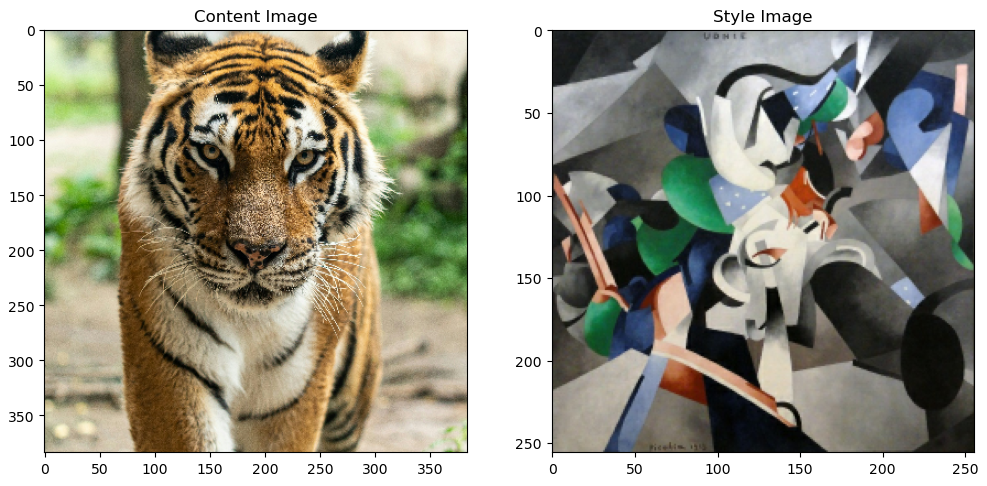
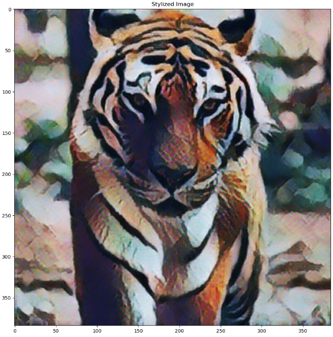

### Neural Style Transfer (TensorFlow Lite)

This project demonstrates real-time neural style transfer using TensorFlow Lite models, where the style of one image is applied to another.

It uses pre-trained lightweight models to efficiently generate stylized images without heavy compute requirements.

### What This Project Does

Takes a content image

Takes a style image (artistic reference)

Applies the style onto the content image

Produces a stylized output image

### How It Works

The pipeline consists of two main stages:

Style Prediction Model

Extracts a style bottleneck from the style image

Style Transformation Model

Applies the extracted style to the content image

For a full walkthrough of the code, functions, and implementation details, please open the main script file in this repository.

See the before picture below:

  

See the after picture below:

  

