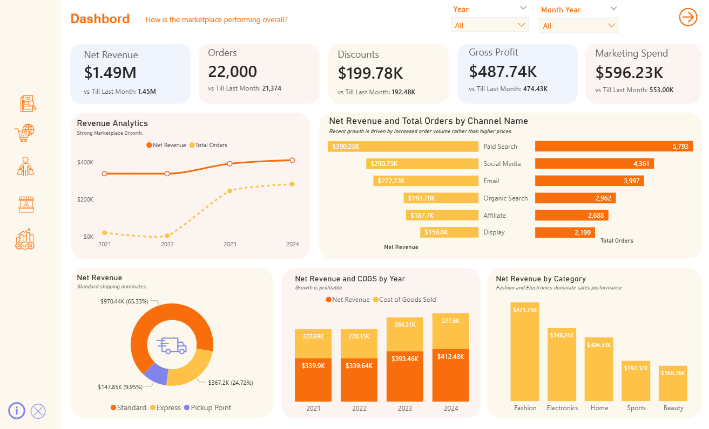
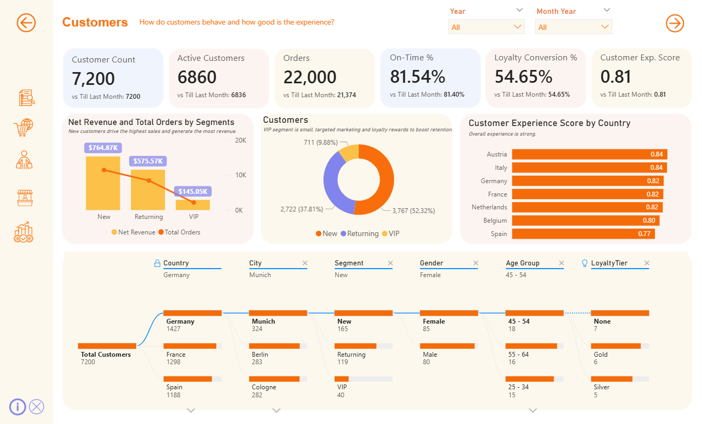
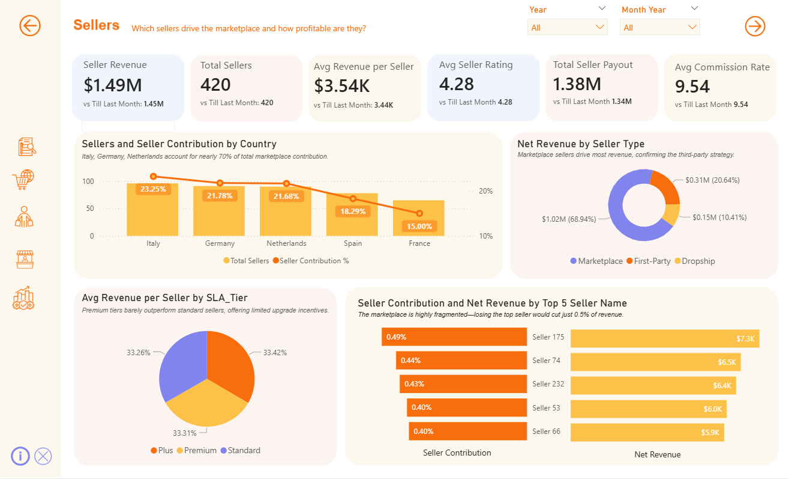

# 📊 Global E-Commerce Performance & Unit Economics Analysis

## 🚀 Executive Summary
This project features a multi-layered interactive dashboard suite built to analyze a **$1.49M e-commerce marketplace**. By synthesizing data across Sales, Marketing, and Operations, I identified critical "profit leaks" in shipping and returns, quantified a **27% loyalty value capture gap**, and proposed a budget reallocation strategy to stabilize a declining **2.45 ROAS**.

---

## 🔍 Deep Dive: Dashboard Analysis (5-Page Report)

### 1. Overall Marketplace Performance
* **The Challenge:** Revenue grew to $1.49M (22k orders), but growth is decoupling from order volume.
* **Critical Insight:** Average Order Value (AOV) is trending downward. We are becoming a "high-volume, low-ticket" marketplace, which increases pressure on fixed logistics costs.
* **Strategic Action:** Implement "Bundle & Save" triggers at checkout to increase AOV and protect net margins.

  

### 2. Marketplace & Unit Economics
* **The Challenge:** High "Logistics Tax" on the top-performing category (Fashion).
* **Critical Insight:** Fashion drives **$471K in revenue**, but high return rates mean we pay for shipping twice (outbound and inbound), creating a "Revenue Mirage."
* **Strategic Action:** Incentivize **"Pickup Point"** delivery (currently only 10% of volume) to reduce shipping subsidies and mitigate the cost of failed transactions.

  

### 3. Customer Experience & Segmentation
* **The Challenge:** A CX Score of **0.81** indicates a plateau in customer loyalty.
* **Critical Insight:** We are capturing only **27% of potential loyalty value**. While we have a strong base in the DACH region, we lack the "wow factor" to move Silver/Gold members into the VIP Platinum tier.
* **Strategic Action:** Launch a targeted VIP migration campaign for the **45–54 age demographic**, who show the highest engagement but lowest tier penetration.

  

### 4. Seller Performance & SLA Tiers
* **The Challenge:** The marketplace is highly fragmented; no single seller contributes >0.5% of revenue.
* **Critical Insight:** **Premium SLA tiers** currently provide zero financial lift over Standard tiers (Avg Revenue Share is identical at ~33%). There is no incentive for sellers to "level up."
* **Strategic Action:** Redesign the Premium Tier to include "Buy Box" priority or lower commission rates to cultivate "Anchor Sellers" who can drive exponential growth.

  

### 5. Marketing Efficiency & Attribution
* **The Challenge:** Ad Spend increased to **$596K**, but efficiency (ROAS) is declining (2.55 → 2.45).
* **Critical Insight:** **Email and Organic Search** are 2x more efficient (4.5 ROAS) than Paid Search (2.3 ROAS), yet they receive significantly less focus.
* **Strategic Action:** Reallocate 15% of the budget from underperforming **Display ads (1.4 ROAS)** into Retargeting and Email to stabilize ROI.

  

---

